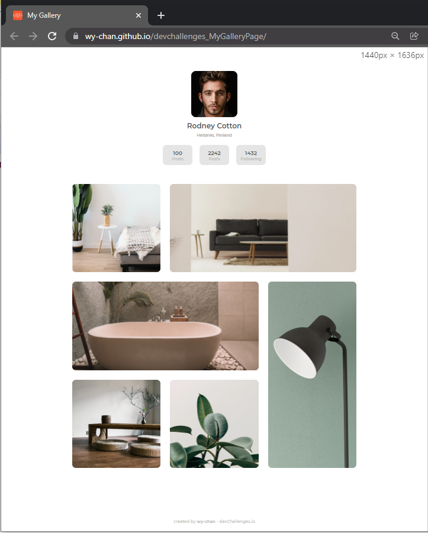
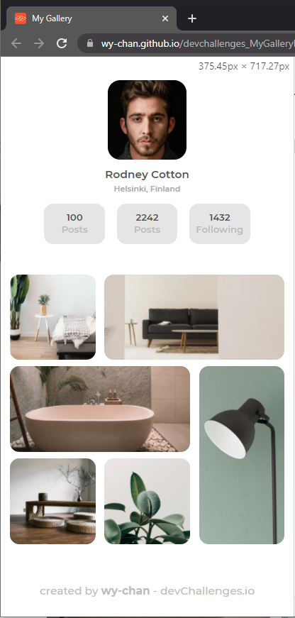

<!-- Please update value in the {}  -->

<h1 align="center">My Gallery Page</h1>

<div align="center">
   Solution for a challenge from  <a href="http://devchallenges.io" target="_blank">Devchallenges.io</a>.
</div>

<div align="center">
  <h3>
    <a href="https://wy-chan.github.io/devchallenges_MyGalleryPage">
      Demo
    </a>
    <span> | </span>
    <a href="https://github.com/wy-chan/devchallenges_MyGalleryPage">
      Solution
    </a>
    <span> | </span>
    <a href="https://devchallenges.io/challenges/gcbWLxG6wdennelX7b8I">
      Challenge
    </a>
  </h3>
</div>

<!-- TABLE OF CONTENTS -->

## Table of Contents

- [Overview](#overview)
  - [Built With](#built-with)
- [Features](#features)
- [How to use](#how-to-use)
- [Contact](#contact)
- [Acknowledgements](#acknowledgements)

<!-- OVERVIEW -->

## Overview

&nbsp;&nbsp;

See demo here: https://wy-chan.github.io/devchallenges_MyGalleryPage/

I created a page based on the given design. The photos are displayed in a grid container.

### Built With

- HTML
- CSS, flexbox, grid

## Features

<!-- List the features of your application or follow the template. Don't share the figma file here :) -->

This application/site was created as a submission to a [DevChallenges](https://devchallenges.io/challenges) challenge. The [challenge](https://devchallenges.io/challenges/gcbWLxG6wdennelX7b8I) was to build an application to complete the following user stories:

- [x] User story: I can see a page following the given design

## How To Use

To clone and run this application, you'll need [Git](https://git-scm.com) and [Node.js](https://nodejs.org/en/download/) (which comes with [npm](http://npmjs.com)) installed on your computer. From your command line:

```bash
# Clone this repository
$ git clone https://github.com/wy-chan/devchallenges_MyGalleryPage

# Install dependencies
$ npm install

# Run the app
$ npm start
```

## Acknowledgements

<!-- This section should list any articles or add-ons/plugins that helps you to complete the project. This is optional but it will help you in the future. For exmpale -->

- [Steps to replicate a design with only HTML and CSS](https://devchallenges-blogs.web.app/how-to-replicate-design/)
- [Marked - a markdown parser](https://github.com/chjj/marked)

- [Google Fonts](https://fonts.google.com/)


## Contact

- GitHub [@wy-chan](https://github.com/wy-chan)
- CodePen [@wy-chan](https://codepen.io/wy-chan)
